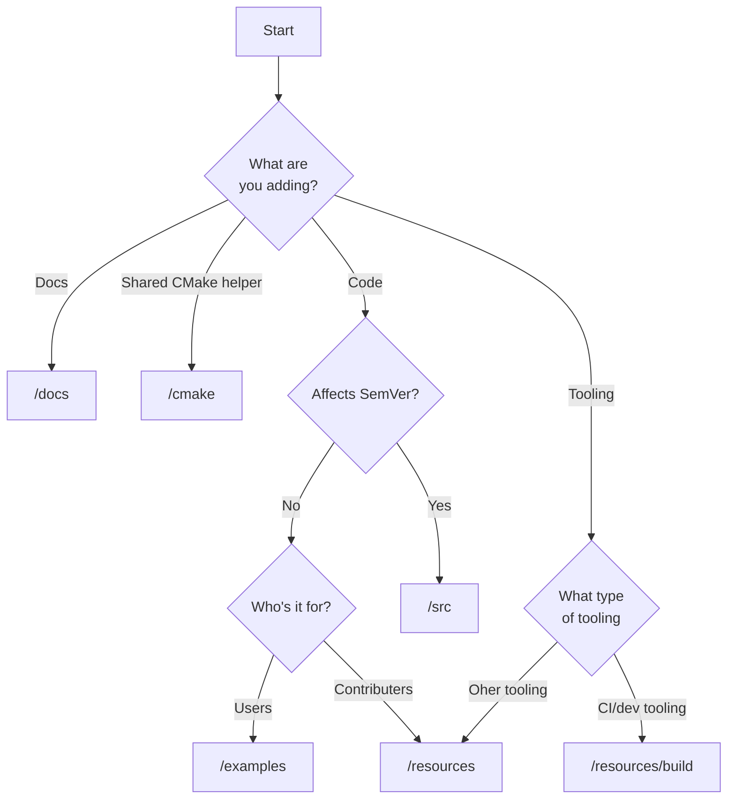

# DR013 Project structure

- **Status:** Proposed
- **Impact:** Low
- **Driver:** @feltech
- **Approver:** @tomfoundry
- **Outcome:**


## Background

OpenAssetIO started life as fork of the pure Python FnAssetAPI. One of
the major improvements we have embarked upon is to migrate the
functionality to a C++ core library, with optional Python bindings.

Performing this migration incrementally has meant that the project
structure in general, and repository directory structure in particular,
still largely reflects the primarily Python-based origin.

The project is logically split into weakly coupled components and
subcomponents, which should ideally be reflected in the file structure,
to aid navigation and potential extraction into separate repositories.

Instead, the project still reflects a typical Python project, with
top-level `python`/`tests` directories and associated
`setup.py`/`pyproject.toml` alongside. This has caused some confusion to
early adopters who, understandably, assume that `pip install` is the
primary build mechanism of the project, when in reality the Python
component is only a small (and optional) slice.

Despite components being logically weakly coupled, there are some
potentially unnecessary dependencies between them. For
example, CMake code under `tests/openassetio-python` is currently
responsible for configuring `ctest` targets for `resources/examples`.

In addition, we are concerned about the clarity of which parts of the
API surface area across all components should strictly trigger (major)
version changes, versus being unsupported/example code.

We therefore wish to explore whether an alternative project directory
structure could help adopters get a clearer at-a-glance picture of the
project make-up and dependency tree, whilst tidying up some technical
debt.


## Relevant data

### Requirements

Requirements of any proposed structure:
* Optional (anything in `resources`, C, Python) components should be
  self-contained.
* Project structure is independent of language/tooling choices used.
* Structure should facilitate the removal of an optional component
  without needing to update its peers (other than upstream
  dependencies).

### Prior art

Looking at a few of the repositories hosted on the [ASWF
Github](https://github.com/orgs/AcademySoftwareFoundation/repositories)
org.

#### [OpenTimelineIO](https://github.com/AcademySoftwareFoundation/OpenTimelineIO)

* C++/Python project. Multiple components.
* `setup.py` at repo root that drives `CMakeLists.txt` at repo root.
* Code grouped by component under `src` directory.
* Python-related code slightly scattered under `src`
  - Pure Python under `opentimelineview` and
    `py-opentimelineio/opentimelineio`.
  - Python bindings under `py-opentimelineio/*-bindings`.
* Tests under repo-root `tests` directory.
  - Mostly Python test sources
  - (Minimal) C++ test sources (with CMakeLists) alongside Python tests.
* Docs (Sphinx) under repo-root `docs` directory.
* Third-party code under `src/deps`
* Separate `contrib` directory for plugins, with independent tests.

#### [MaterialX](https://github.com/AcademySoftwareFoundation/MaterialX)

* C++/Python/Javascript project. Multiple components.
* Only `CMakeLists.txt` at repo root.
* C++ code grouped by component under repo-root `source` directory.
  - Including C++ components for Python and Javascript bindings.
* Pure Python code under repo-root `python` directory. Similarly for
  `javascript`.
  - `python` directory holds a `setup.py.in` template, rendered by CMake
    into the install tree.
* Tests in `MaterialXTest` directories, split between `source` (C++),
  `python` and `javascript` directories.
* Docs (Doxygen, PDF, Markdown) under repo-root `documents`.
* Build system helpers under repo-root `cmake/modules`.
* Examples under repo-root `resources`.
* Core material library under repo-root `libraries`.

#### [OpenVDB](https://github.com/AcademySoftwareFoundation/openvdb)
* C++/Python project. Multiple components.
* Only `CMakeLists.txt` at repo root.
* Components grouped in their own directories at the root of the repo.
* No pure Python code. Python bindings located alongside other C++
  sources under `openvdb/openvdb/python`, installed to CMake install
  tree.
* Tests for C++ alongside C++ sources under `openvdb/openvdb/unittest`,
  (minimal) tests for Python alongside the bindings under
  `openvdb/openvdb/python/test`.
* Docs (Doxygen) under repo-root `doc`.
  - TSC meeting notes in repo-root `tsc`.
* CI/build helpers under repo-root `ci` and `cmake`.

#### [Imath](https://github.com/AcademySoftwareFoundation/Imath)
* C++/Python project. Single component.
* Only `CMakeLists.txt` at repo root.
* C++ code placed under `src/Imath`
* No pure Python code. Python bindings located in separate `src/python`
  directory.
* Tests for C++ under `src/ImathTest`, tests for Python bindings under
  `src/python/PyImath*Test`.
  - Python tests are old-school `assert`-based pure Python files (but
    with extension `.in`) and executed as CTest tests.
* Docs (Doxygen, Sphinx) under `docs`
* CI/build helpers under repo-root `share/ci/scripts`, `cmake` and
  `config` directories.

#### [OpenColorIO](https://github.com/AcademySoftwareFoundation/OpenColorIO)

* C++/Python/Java project. Multiple components.
* `setup.py` at repo root that drives `CMakeLists.txt` at repo root.
* Code grouped by component under `src` directory.
  - Sub-groupings under subdirectories too, e.g. `apps`, `bindings`.
  - Public headers under repo-root `include` directory.
* No pure Python code. Python bindings located under
  `src/bindings/python`. Similarly for Java.
* Tests located under repo-root `tests`.
  - Subdirectories split core tests, test utils and tests of optional
    components, with `cpu` containing the core C++ tests and `python`
    containing pure Python tests.
* Docs (Doxygen, Sphinx) under `docs`.
  - ASWF meeting notes under `ASWF`.
* CI/build/docs helper scripts under subdirectories of repo-root `share`
  directory.
* Plugins for DCC tools under subdirectories of the repo-root `vendor`
  directory, with additional scripts under subdirectories of the
  repo-root `share` directory.

## Options considered

### Option 1

Current structure.

```
.
├── cmake
├── contributing
├── decisions
├── doc
│   └── src
├── logo
├── python
│   └── *.py
├── resources
│   ├── build
│   ├── examples
│   │   ├── host
│   │   │   └── simpleResolver
│   │   └── manager
│   │       └── SampleAssetManager
│   └── openassetio-traitgen
├── src
│   ├── openassetio-core
│   │   ├── include
│   │   │   └── *.hpp
│   │   └── *.cpp
│   ├── openassetio-core-c
│   │   ├── include
│   │   │   └── *.h
│   │   └── *.c
│   └── openassetio-python
|       ├── bridge
│       │   ├── include
│       │   │   └── *.hpp
│       │   ├── *.cpp
│       ├── module
│       │   └── *.cpp
│       └── private
│           └── include
│               └── *.hpp
├── tests
│   ├── openassetio-core
│   │   └── *.cpp
│   ├── openassetio-core-c
│   │   └── *.cpp
│   ├── openassetio-python
│   │   └── *.cpp
│   └── python
│       └── *.py
└── thirdparty
    └── tomlplusplus
```

#### Pros

 - No work to do.

#### Cons

- Public header paths (`include`) are mixed up with private source
  paths, despite them being semantically distinct.
- Bundling some third-party dependencies and supplying others externally
  is inconsistent. This was only done to support building on an
  unmodified ASWF Docker image, which is not a compelling reason.
- Duplication of `if (OPENASSETIO_ENABLE_<COMPONENT>)` under `tests`

Estimated cost: Small


### Option 2

* Place pure Python component under `src/openassetio-python/python`
  directory, excluding `setup.py` and `pyproject.toml`.
* Move tests under the component that they are testing.
  - Trickier for pure Python tests that cover multiple components. So
    simply place alongside the Python package, i.e. in
    `src/openassetio-python/python/tests`
* Place `_openassetio_test` Python C++ extension module sources
  alongside the `_openassetio` module.
* Conform directory structure for C++ code with `include`, `src` and
  `tests` subdirectories.
* Place docs subdirectories under the repo-root `doc` directory (with
  the addition of a `doxygen` subdirectory).
* Remove the `thirdparty` directory - solving the problem with the ASWF
  Docker image by inheriting from the Dockerfile and baking in
  additional dependencies.

```
.
├── cmake
├── doc
│   ├── contributing
│   ├── decisions
│   └── doxygen
│       └── src
├── examples
│   ├── host
│   │   └── simpleResolver
│   └── manager
│       └── SampleAssetManager
├── resources
│   └── build
└── src
    ├── openassetio-traitgen
    ├── openassetio-core
    │   ├── include
    │   │   └── *.hpp
    │   ├── src
    │   │   └── *.cpp
    │   └── tests
    │       └── *.cpp
    ├── openassetio-core-c
    │   ├── include
    │   │   └── *.h
    │   ├── src
    │   │   └── *.cpp
    │   └── tests
    │       └── *.cpp
    └── openassetio-python
        ├── bridge
        │   ├── include
        │   │   └── *.hpp
        │   └── src
        │       └── *.cpp
        ├── module
        │   ├── _openassetio
        │   │   └── src
        │   │       └── *.cpp
        │   ├── _openassetio_test
        │   │   └── src
        │   │       └── *.cpp
        ├── python
        │   ├── openassetio
        │   │   └── *.py
        │   ├── tests
        │   │   ├── openassetio
        │   │   │   └── *.py
        │   │   ├── openassetio_test
        │   │   │   └── *.py
        └── shared
            └── src
                └── *.hpp
```

#### Pros

- Python-related code is grouped together, making it easier to navigate.
- More lightweight repo root directory with less noise.
- Components can be extracted into their own repo with relative ease.
- Distinguishes public headers from source files through consistent
  `include` and `src` directory pairs.
- Clearly distinguishes core components that should affect (major)
  versioning of the project (`/src`) vs. less important snippets used
  primarily for documentation (`/examples`)
- Third-party dependencies are all externally supplied, rather than
  mixing bundled dependencies with externally supplied dependencies.

#### Cons

- Duplication of .clang-tidy tests override
- Test-related helpers (e.g. CMake functions) must move to a common
  directory, rather than being naturally located next to where they're
  used, i.e. under a top-level `tests` directory.
- Duplication of `if (OPENASSETIO_ENABLE_TESTS)` in CMake under each
  component.

Estimated cost: Medium


## Outcome

We will restructure the codebase as specified in Option 2. Grouping
relevant code by component makes the codebase much easier to navigate
and facilitates eventual extraction of components into their own repo.

Therefore, when deciding where a new file should go we should observe
the following decision tree:


