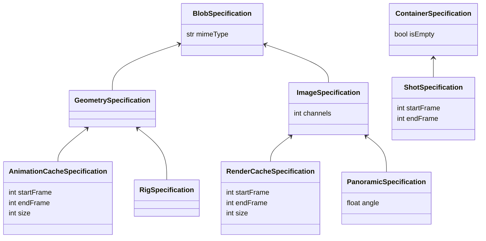
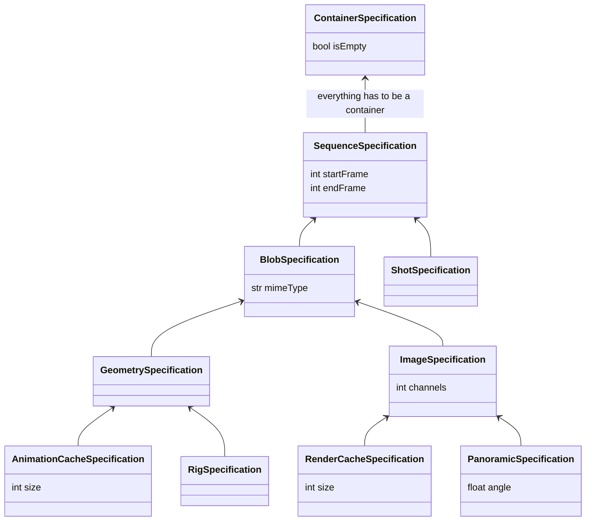
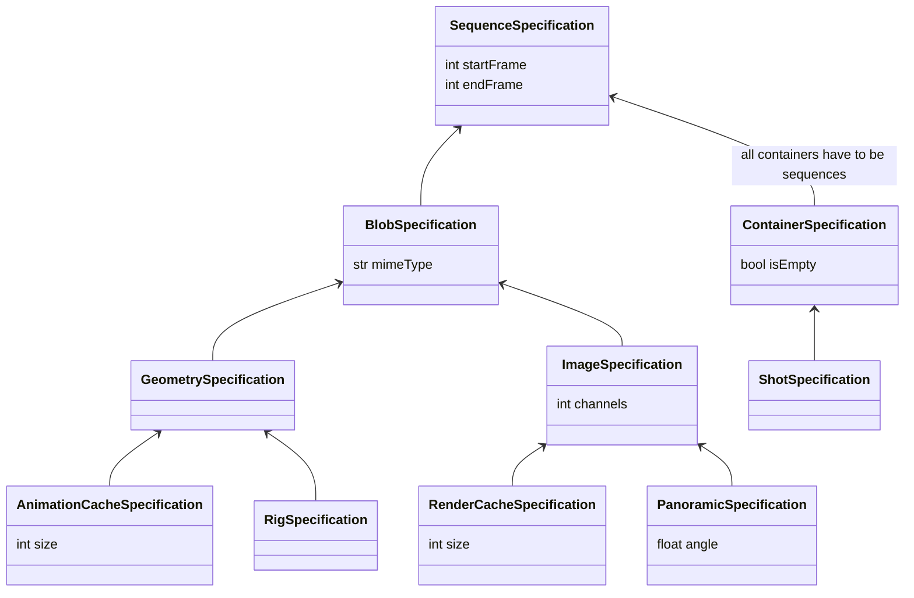
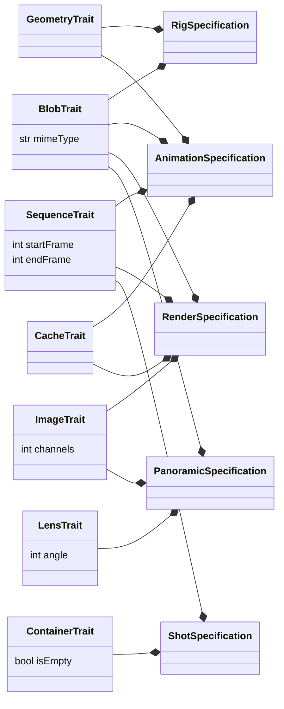

# DR007 Hierarchical or composition based traits for specifications

- **Status:** Decided
- **Impact:** High
- **Driver:** @carmenpinto
- **Approver:** @feltech
- **Contributors:** @foundrytom @feltech @fnRaihanKibria
- **Outcome:** OpenAssetIO will use a trait-composition based typing
  system instead of a hierarchical approach.

## Background

Specifications are used to define the nature of entities, relationships,
or locales in OpenAssetIO. These definitions can be used to determine
acceptable behaviours by a Manager[^1] system to act on the
specification, or to determine how the Host[^2] interacts through
OpenAssetIO. Reducing the amount of code required to deal with each
specification can be achieved by defining guarantees about the
specifications. How specifications are defined in terms of their
relation to each other and the degree that these classifications should
be enforced are discussed in the options below.

The current design of the OpenAssetIO specification system comes from
prior work, where it was successfully employed in the development of
real-world editorial and post-production workflows connecting
commercially available DCCs tools and asset management systems.

## Relevant data

There are a few challenges to defining specifications. The types of
entities manipulated by Managers continually grow over time as new
software and file formats and new ways of creating images and scenes are
added. Specifications have to continue to be able to keep their
guarantees about their types while new guarantees are added. This makes
it easier for DCCs, their developers, and users of the pipeline to be
able to add to the types available without losing shared behaviour
between specifications - both across DCCs and shared between the
OpenAssetIO community. These types of entities, relationships and
locales can't be counted on to be exactly the same, but defining the
similarities between them so that they can fulfill reliable behaviours
is important so that the specifications have sharable meaning.

OpenAssetIO requires a mechanism capable of precisely describing
entities, relationships and locales with the following criteria:

- Hierarchical or Composable (to support coercion of custom definitions
  to well-known behavioural traits)
- Simple in structure (to simple data types for interop/serialisation)
- Robust (compile-time checks for programming errors - property access
  or invalid method arguments)
- Discoverable (runtime introspection/help)
- Definable out of core (by host integrations/managers)

Precedents exist to deal with the criteria above. USD[^3] supports
coercion of custom definitions to well-known behavioural traits through
USD schemas. It allows some schemas to be applied to primitives, which
gives them attributes and behaviours specified by the schema. For
example, `UsdGeomModelAPI` adds bounding extents to primitives, as well
as the ability to create a constraint target. Applied schemas can't
inherit from each other. Schemas that provide a type instead of being
applied to a primitive can be hierarchical. An example of this
is `UsdGeomXformable`, which inherits from `UsdGeomImageable`
. `UsdGeomImageable` provides an interface for computing the visibility
of the primitive, `UsdGeomXformable` adds the ability to manipulate the
transform of primitives that are of this type as well as keeping the
visibility attributes. Applied schemas are used on these typed schemas
to share functionality.

A case of this is occurring is with mesh lights - a geometry object that
should have light behaviours. A typed, hierarchical, schema `Light` in
USD was rewritten as an applied schema `UsdLuxLightAPI` so light
behaviours could be added to other schemas -
see [Adapting UsdLux to Accommodate Geometry Lights](https://graphics.pixar.com/usd/release/wp_usdlux_for_geometry_lights.html)
. The mesh light could be then represented as a primitive of
the `UsdGeomMesh` schema, with the `UsdLuxLightAPI` applied. This is a
working example of the necessity of being able to share guaranteed
behaviours causing the emergence of more trait based specifications.

## Options considered

### Option 1

Hierarchical specifications with a single parent per child. We assume
that every child fulfills the contract of its parent. For example, that
all alembic files are a geometry cache, and that all geometry caches
might have coordinate system based data, and that all geometry caches
are a type of binary blob. This could be described in a
specification: `entity.blob.geometry.cache.alembic`. Another example
could be an exr render, which could be a type of image, which could also
be a type of blob binary data, represented as: `entity.blob.image.exr` .

#### Pros

- There's only one way to represent the specification
- Inheritance provides an automatic fall back mechanism
- Has been proven in real-world, working scenarios

#### Cons

- It's difficult to insert new specifications in between types, requires
  updating the child type identifier of the new insert in the case of
  back-end stores. For example, should the schema change between shows,
  and the entities need to be compared, the entity type would have to be
  mapped manually for any tools relying on it.
- This requires knowledge of as many possible entities as possible to be
  efficiently taxonomied into an efficient and useful hierarchy
- Sharing behaviours between taxonomically unrelated types - for example
  a frame range applied to both a geometry cache and a shot - is
  difficult, it relies on duplicated property definitions on each of
  specifications, meaning that the trait of “having a frame range"
  becomes implied though well-known property names, rather than an
  explicitly stated trait
- In order to share well-known base specification hierarchies with the
  OpenAssetIO community, interop is facilitated through the use of
  common base specifications. If these base hierarchies change, every
  place where the schema was persisted will no longer be able to
  interact with each other despite possibly having the same expected
  behaviour

### Option 2

Trait based compositional specifications. Specifications are made from
generic traits that guarantee certain behaviours or consumption patterns
from the Manager or Host. The alembic cache could be represented as the
following: `entity.geometry.cache`. The exrs rendered out from the
Option 1 example could also be represented as `entity.image.cache` as
they are a type of image cache. Managers that are interested in freeing
up some memory could then query `entity.cache` and schedule them for
deletion.

#### Pros

- Adding to specifications is easy by adding traits
- Traits can be shared between specifications easily without needing to
  hide them as emergent phenomena based on well-known property names
- Common traits can be shared with the OpenAssetIO community without
  having to exactly match a whole specification, decreasing the risk of
  inclusion of very well known traits (such as `blob`)
  in the core API if required

#### Cons

- Traits can be contradictory
- Working with traits could be more complex than working with a single
  parent hierarchy due to multiple combinations of traits being possible
- Duplication of traited specification is possible
- Not yet practically validated
- Changes to specific traits still affects all specifications that
  incorporate them

## Outcome

We will adopt Option 2.

## Rationale

Using traits changes the meaning of the specification from
classification to a purpose-driven, exact requirement approach. It
increases the shareability and extensibility of specifications through
the modular traits, and avoids hidden traits being expressed through
“magic” groups of well-known properties where the hierarchy precluded
them being ancestors. Although it could potentially add complexity in
terms of mapping traits to specifications, the ability to search by
exactly the aspect of the specification that is required could reduce
having to traverse over classifications while guaranteeing the behaviour
can be applied.

## Appendix

### Implementation sketches

#### Option 1

In this hierarchy, the startFrame and endFrame properties are duplicated
a few times due these types not being able to share a base.

```
  specification Blob {
    class BlobSpecification
    str mimeType
  }
  specification Blob.Geometry {
    class GeometrySpecification
  }
  specification Blob.Geometry.AnimationCache {
    class AnimationCacheSpecification
    int startFrame
    int endFrame
  }
  specification Blob.Geometry.Rig {
    class RigSpecification
  }
  specification Blob.Image {
    class ImageSpecification
    int channels
  }
  specification Blob.Image.RenderCache {
    class RenderCacheSpecification
    int startFrame
    int endFrame
  }
  specification Blob.Image.Panoramic {
    class PanoramicSpecification
    float angle
  }
  specification Container {
    class ContainerSpecification
    bool isEmpty
  }
  specification Container.Shot {
    class ShotSpecification
    int startFrame
    int endFrame
  }
```



If we change the hierarchy to share Sequence, Rig and Panoramic now have
an unwanted startFrame and endFrame property that might not apply. In
addition, all sequences have to be containers, or all containers have to
be sequences.





#### Option 2

This lets us specify only the properties that apply to the
specification, without duplication.

```
  trait Blob {
    class BlobTrait
    str mimeType
  }
  trait Geometry {
    class GeometryTrait
  }
  trait Image {
    class ImageTrait
    int channels
  }
  trait Lens {
    class LensTrait
    int angle
  }
  trait Sequence {
    class SequenceTrait
    int startFrame
    int endFrame
  }
  trait Cache {
    class CacheTrait
    int size
  }
  trait Container {
    class ContainerTrait
    bool isEmpty
  }
  
  specification AnimationCache {
    class AnimationCacheSpecification
    traits: blob, geometry, sequence, cache
  }
  specification Rig {
    class RigSpecification
    traits: blob, geometry
  }
  specification RenderCache {
    class RenderCacheSpecification
    traits: blob, sequence, image, cache
  }
  specification Panoramic {
    class PanoramicSpecification
    traits: blob, image, lens
  }
```



### Checking management policies

Often a Host may want to check management policies for a broader range
of entity types based on some common shared properties.

#### Option 1

When using management interface functions the code using specifications
is the same for Option 1 and Option 2.

```python
# uses specifications from "An implementation sketch of Option 1"

# check if Images and Geometry are managed
policy = manager.managementPolicy(
    [ImageSpecification(), GeometrySpecification()], context)

# manager offers to manage Image and Geometry specifications, and anything that descends from those
policy == [kManaged, kManaged] 
```

#### Option 2

```python
# uses traits from "An implementation sketch of Option 2"

# check if Specifications with Image or Geometry traits are managed
policy = manager.managementPolicy(
    [ImageSpecification, GeometrySpecification], context)

# manager offers to manage Specifications with ImageTraits or GeometryTraits
policy == [kManaged, kManaged] 
```

It could be possible to query combinations of these traits, such as by
accepting lists of lists in Python.

```python
# uses traits from "An implementation sketch of Option 2"

# check if Sequenced Images or Sequenced Geometry are managed
policy = manager.managementPolicy(
    [[ImageTrait, SequenceTrait], [GeometryTrait, SequenceTrait]],
    context)

# manager offers to manage Specifications that are Sequenced Images or Sequenced Geometry
policy == [kManaged, kManaged] 
```

### Finding all the caches associated with a shot

The resulting entity references could be used to help clear up space on
disk when they're no longer necessary for work.

Assumes the following set up:

```python
assets = ["asset://fxPointsCache",  # a geometry cache of point data
          "asset://precompShadows"]  # rendered image of shadows

shots = ["shot://ABC/01"]

```

#### Option 1

```python
manager.getRelatedReferences(shots, [RenderCacheSpecification(),
                                     GeometryCacheSpecification()],
                             context, session)

# expected output: [["asset://fxPointsCache"], ["asset://precompShadows"]]
```

#### Option 2

```python
manager.getRelatedReferences(shots, [CacheTrait], context, session)

# expected output: [["asset://fxPointsCache", "asset://precompShadows"]]
```

### List all the frame ranges in the host application

In a host using a single shot, finding which entities aren't currently
rendered with enough frames to cover the shot length could be useful.

In this case, since having a frame range can't be part of the hierarchy
without also affecting all leaf specifications in the hierarchy, it's
considerably easier to specify the wanted trait versus having to list
every possible specification where the frame range attributes might
exist.

#### Option 1

```python
specifications = [RenderCacheSpecification(),
                  GeometryCacheSpecification(),
                  ShotSpecification()]

for specification in specifications:
    entityRefs = hostInterface.knownEntityReferences(specification)
    entityAttributes = manager.getEntityAttributes(entityRefs, context,
                                                   session)

    for entity in entityAttributes:
        print("Frame range: ", entity[constants.kField_FrameStart],
              "-", entity[constants.kField_FrameEnd])
```

#### Option 2

```python
entityRefs = hostInterface.knownEntityReferences(SequenceTrait())
entityAttributes = manager.getEntityAttributes(entityRefs, context,
                                               session)
for entity in entityAttributes:
    print("Frame range: ", entity[constants.kField_FrameStart],
          "-", entity[constants.kField_FrameEnd])
```

## Terminology

[^1]: The manager is a system that serves as the source of truth
regarding the status or location of digital media or other
organizational aspects of a project.

[^2]: The host is an Application, tool or script that makes use of the
API to interact with an asset management system - anything from a
pipeline script to a Digital Content Creator application: like Blender,
Maya, Nuke, Houdini.

[^3]: USD is Pixar's framework for interchange of 3D computer graphics
data.